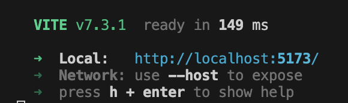

- [Описание проекта](#Описание-проекта)
- [Зависимости](#Зависимости)
- [Установка и запуск](#Установка-и-запуск)
  * [Требования](#Требования)
  * [Установка зависимостей](#Установка-зависимостей)
  * [Запуск (dev сервер)](#Запуск-(dev-сервер))
- [Примеры использования](#Примеры-использования)
- [API компонентов](#API-компонентов)
- [Хуки](#Хуки)
- [Кастомизация стилей](#Кастомизация-стилей)
  * [CSS переменные](#CSS-переменные)
  * [Доступные цвета](#Доступные-цвета)
  * [Переопределение через className](#Переопределение-через-className)
- [Идеи дальнейших улучшений](#Идеи-дальнейших-улучшений)

## Описание проекта

Библиотека, реализующая компоненты `Chip` и `ChipList` --  компонент, отображающий список чипсов и удовлетворяющие следующим требованиям:
- **Отображение в одну строку**: все чипсы располагаются в одну строку на всю ширину родительского контейнера. Те чипсы, которые не помещаются в строке, доступны через popover, который открывается при клике на соответствующую кнопку. 
- **Адаптивность**: Список чипсов автоматически подстраивается под изменение ширины экрана и/или размера самих чипсов (например, вследствие выбора чипса и изменения его стиля)
- **Выбор чипсов**: Возможно выбирать чипс по клику на него.
- **Модульность**: Чипс должен иметь возможность быть использованным отдельно, вне списка.

На данный момент поддерживается использование `ChipList` только в качетсве контейнера, отображающего конкретно `Chip`, но код адаптирован под возможность в ближайшее время вынести функцию для рендера одного элемента (идеаологически chip-элемента) в props у `ChipList`, что позволит переиспользовать его с другими реализациями Chip-подобных элементов. 

*(Данная реализация будет добавлена отдельной веткой, на данный момент состояние:* $${\color{red}не \space реализовано}$$*)*

## Зависимости

`@floating-ui` для реализации popover-компонента.

## Установка и запуск
### Требования
- Node.js >= 18.18
- npm, pnpm или yarn

### Установка зависимостей

В корне проекта выполните команду:

```bash
npm install
```

### Сборка

После установки зависимостей в корне проекта выполните команду:

```bash
npm run build
```

### Запуск примера

В корне проекта выполните

```bash
npm install
npm run example
```

По умолчанию сервер запустится на [http://localhost:5173](http://localhost:5173). Если порт 5173 недоступен, будет выбран другой доступный порт. Актуальный адрес будет виден в графе **Local**:




**WARNING:** из-за того, что example находится внутри chip-list, а библиотека импортируется через `file:..` возможны проблемы с пакетами (например, можно сначала сделать `npm install` в корне, потом в `example`, а потом попытаться запустить `example` с помощью `npm run dev` в `example` и получить две версии `react`, что сломает весь `example`). Методы решения: удалить повторяющиеся пакеты из `example/node_modules` самостоятельно или запускать 
```bash
npm run example
```
как рекомендовано выше. Скрипт `npm run example` все соберет и почистит самостоятельно.

## Примеры использования

### Базовый пример

```tsx
import { ChipList, type ChipData } from "./index";

function App() {
  const items: ChipData[] = [
    { id: 1, label: "React" },
    { id: 2, label: "TypeScript" },
    { id: 3, label: "Vite" },
  ];

  return <ChipList items={items} />;
}
```

### С кастомизацией стиля через props

```tsx
<ChipList 
  items={items}
  chipStyle={{
    color: "accent",
    variant: "outlined",
    size: "medium",
  }}
  triggerStyle={{
    color: "neutral",
    variant: "filled",
  }}
/>
```

### Отдельный компонент Chip

```tsx
import { Chip } from "./index";

function MyComponent() {
  const [selected, setSelected] = React.useState(false);

  return
    <Chip 
      label="Click me"
      selected={selected}
      onSelectChange={() => setSelected(!selected)}
      color="accent"
      variant="filled"
      size="medium"
    />;
}
```

## API компонентов

<details> <summary> <strong style="font-size: 1.3em;">  <code>Chip</code></strong></summary>
    
Чипсы (чипы, chips) — это компактные элементы, которые представляют вводные данные, атрибуты или действия. В данном случае реализация Chip предоставляет в основном Base и Filter Chip. Компонент быть статичным (не кликабельным) или интерактивным — в контексте Filter Chip означает возможность "быть выбранным".

| Свойство         | Тип               | По умолчанию                               | Описание                                                                                             |
| ---------------- | ----------------- | ------------------------------------------ | ---------------------------------------------------------------------------------------------------- |
| `label`          | `React.ReactNode` | **обязательный**                           | Содержимое чипа. Может быть текстом, иконкой или любым React-узлом. Отображается в одну строку.      |
| `selected`       | `boolean`         | `undefined` (по стилю совпадает с `false`) | Находится ли чип в выбранном состоянии                                                               |
| `onSelectChange` | `() => void`      | `undefined`                                | Коллбэк, вызываемый при изменении выбора (клик)                                                      |
| `disabled`       | `boolean`         | `false`                                    | Если `true`, чип отключен и неактивен                                                                |
| `color`          | `ChipColor`       | `"neutral"`                                | Цветовая тема чипа: `"neutral"` \| `"accent"` \| `"success"` \| `"warning"` \| `"error"` \| `"info"` |
| `variant`        | `ChipVariant`     | `"filled"`                                 | Визуальный стиль: `"filled"` \| `"outlined"`                                                         |
| `size`           | `ChipSize`        | `"medium"`                                 | Размер чипа: `"small"` \| `"medium"`                                                                 |
| `className`      | `string`          | —                                          | Дополнительные CSS-классы для кастомных стилей                                                       |

</details>

<details> <summary> <strong style="font-size: 1.3em;">  <code>ChipList</code></strong></summary>

Контейнер, отображающий список элементов в виде Chip-компонентов со встроенной адаптивностью и popover для скрытых элементов.

Автоматически вычисляет, сколько чипов помещается в контейнере, и прячет остальные под кнопку "ещё" с popover-ом.

| Свойство       | Тип                      | По умолчанию                           | Описание                                                                                                           |
| -------------- | ------------------------ | -------------------------------------- | ------------------------------------------------------------------------------------------------------------------ |
| `items`        | `<T extends ChipData>[]` | `обязательный`                         | Массив элементов для отображения в виде чипов. Должны удовлетворять интерфейсу `ChipData` (см. ниже)               |
| `chipStyle`    | `ChipStyle`              | — (Сhip берет свой стиль по умолчанию) | Стиль всех чипов в списке (цвет, вариант, размер). Применяется ко всем элементам                                   |
| `triggerStyle` | `TriggerStyle`           | —                                      | Стиль кнопки-триггера, открывающей popover со скрытыми элементами. Если не указан, пытается наследовать chipStyle. |

**`ChipData`** — базовый интерфейс для элемента списка. Обязывает передаваемые в items списком объекты типа `T` иметь:

- `id`: `ChipID = number | string` — уникальный идентификатор чипа
- `label`: `React.ReactNode` — контент, который отображается на чипе (в большинстве случаев ожидается текст).

**`ChipStyle`** — объект, содержащий в себе стилевые props компонента `Chip` ( `color`, `variant` и `size`). 

**`TriggerStyle`** — объект, содержащий в себе стилевые props кнопки для скрытия элемента. На данный момент для поддержки единого стиля со списком поддерживает ровно те же `color`, `variant` и `size`, что и `Chip`.

</details>

## Хуки

<details> <summary> <strong style="font-size: 1.3em;">  <code>useMultiSelect&lt;T&gt;()</code></strong></summary> 

Хук для управления множественным выбором элементов. (Потенциально может быть расширен другими полезными callback-ами, например, *selectAll*)

Возвращает следующие объекты:

| Свойство      | Тип                  | Описание                                |
| ------------- | -------------------- | --------------------------------------- |
| `selectedIds` | `Set<T>`             | Множество выбранных идентификаторов     |
| `toggle`      | `(id: T) => void`    | Функция для переключения выбора         | элемента |
| `isSelected`  | `(id: T) => boolean` | Функция для проверки, выбран ли элемент |

</details>

<details> <summary> <strong style="font-size: 1.3em;">  <code>useVisibleChips()</code></strong></summary> 

Хук для динамического вычисления того, сколько элементов помещается в контейнере. Специально разработан для компонента `ChipList`, чтобы определять, сколько чипов показать, а сколько спрятать под popover.

### Параметры

| Параметр | Тип | Описание |
| ---- | ---- | ---- |
| `containerRef` | `React.RefObject<HTMLDivElement \| null>` | ref контейнера, в котором отображаются чипы |
| `chipRefs` | `React.RefObject<(HTMLElement \| null)[]>` | refs всего списка чипов |
| `moreButtonRef` | `React.RefObject<HTMLButtonElement \| null>` |ref кнопки "ещё" |

Возвращает следующие объекты:

| Свойство | Тип | Описание |
| ---- | ---- | ----- |
| `visibleCount` | `number` | Количество чипов, помещающееся в контейнер для отрисовки |

Хук автоматически пересчитывает количество видимых элементов когда:

- Меняется ширина контейнера (например, при ресайзе окна)
- Меняется ширина любого чипа (например, при изменении текста)
- Меняется ширина кнопки "ещё"
- Добавляются или удаляются элементы

Так же хук поддерживает измерение расстояния между элементами. В нынешней реализации предполагается, что оно одинаково между парами соседних элементов.

</details>

## Кастомизация стилей

### CSS переменные

Компоненты используют CSS переменные для цветовой схемы. Определите в вашем глобальном CSS:

```css
:root {
  /* Требуемые переменные (для совместимости компонентов) */
  —color-surface: #242424;      /* Фоновый цвет поверхности */
  —color-on-surface: white;     /* Цвет текста на поверхности */
}
```

Если не определены, компоненты используют system default значения (`light-dark(white, #242424)` для `—color-surface` и `light-dark(black, white)` для `—color-on-surface`).

Эти цвета используются для того, чтобы соответсвующим образом рассчитать цвета для стилизации popover-окна, chip и кнопки "еще" (trigger для popover).

Также компонеты `Chip` и `ChipListPopoverTrigger`(кнопка "еще") используют свои локальные стилевые переменные для расчета цветовой схемы: ` --chip-color-main`, `--chip-color-text` и `--trigger-color-main`, `--trigger-color-text` соответственно.

- **`--${element}-color-main`** определяет основной цвет чипа (акцентный, прямо используется для `selected` стиля)
- **`--${element}-color-text`** определяет цвет текста, контрастный с `--${element}-color-main` (для отображения текста на фоне `--${element}-color-main`) 

### Доступные цвета

| Color | Примечание |
|----|----|
| `neutral` |  фиолетовый (`purple`) |
| `accent` | жёлтый (`yellow`)|
| `error` | красный (`rgb(214, 1, 1)`)|
| `info` | синий (`cornflowerblue`)|
| `success` | зелёный (`lime`)|
| `warning` | оранжевый (`orange`)|

### Переопределение через className

`Chip` поддерживает передачу своего className в качестве параметра; className не заменяет классы `Chip`, а дополняет.


## Идеи дальнейших улучшений

- [ ] Chip: кастомные цвета, размеры, возможно props passing
- [ ] Chip: добавить полноценную поддержку иконок 
- [ ] Chip: обработка ввода с клавиатуры
- [ ] ChipList: поддержать gap в стилизации ChipList
- [ ] ChipList: поддержать клавиатурную навигацию
- [ ] ChipListPopover: поддержать gap из ChipList?
- [ ] ChipListPopover: поддержать клавиатурную навигацию
- [ ] ChipListPopover: кастомизируемая иконка/содержимое trigger кнопки
- [ ] СhipList: переход на renderItem
- [ ] СhipList: реорганизация через контекст для лучшей кастомизации контента
- [ ] useVisibleCount: улучшение методики подсчета (изучить варианты оптимизации и целесообразность их применения: например, хранение префиксных сумм размеров чипсов и бинпоиск visibleCount; при поиске visibleCount за n использовать вместо суммы размеров элементов + gap на каждом шаге разность правой границы текущего элемента и левой границы первого элемента (даст поддержку неодинаковых gap между элементами?))
- [ ] поддержка других видов Chip (например, deletable)
- [ ] разнообразить кастомные хуки (например, для singleSelect, выбора ограниченного числа элементов, поддержки удаления/добавления элементов)
- [ ] ревью и поддержка Accessibility (ARIA roles, ARIA states, keyboard navigation)
